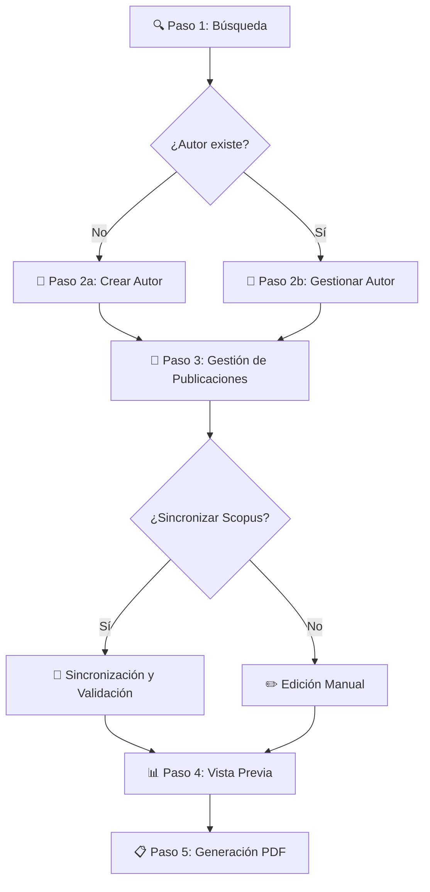

# 🌐 Sistema de Reportes de Publicaciones Académicas - Frontend

> **Interfaz web moderna y corporativa para gestión integral de publicaciones académicas con flujo de trabajo por pasos**

[](https://nextjs.org)
[](https://reactjs.org)
[](https://typescriptlang.org)
[](https://tailwindcss.com)
[]()

## � Tabla de Contenidos

- [🎯 Descripción](#descripción)
- [✨ Características](#características)
- [🏗️ Arquitectura Frontend](#arquitectura-frontend)
- [🔄 Flujo de Trabajo Corporativo](#flujo-de-trabajo-corporativo)
- [📁 Estructura del Proyecto](#estructura-del-proyecto)
- [🎨 Componentes Principales](#componentes-principales)
- [🚀 Instalación](#instalación)
- [🔧 Scripts y Configuración](#scripts-y-configuración)
- [🌐 Integración con API](#integración-con-api)
- [📱 Diseño Responsivo](#diseño-responsivo)
- [🎯 Características de UX](#características-de-ux)
- [🚀 Deployment](#deployment)
- [🐛 Solución de Problemas](#solución-de-problemas)
- [🤝 Contribución](#contribución)

---

## 🎯 Descripción

Interfaz web corporativa moderna que proporciona un flujo de trabajo estructurado por pasos para la gestión integral de publicaciones académicas. Diseñada para facilitar la búsqueda, gestión y generación de reportes de manera intuitiva y eficiente.

### Filosofía de Diseño

- **Enfoque Corporativo**: Interfaz profesional adaptada a entornos académicos institucionales
- **Flujo por Pasos**: Proceso guiado que simplifica tareas complejas
- **User-Centric**: Diseño centrado en la experiencia del usuario académico
- **Escalabilidad**: Arquitectura preparada para crecimiento y nuevas funcionalidades

---

## ✨ Características

### Arquitectura y Desarrollo

- **Next.js 14** con App Router para rendimiento óptimo
- **TypeScript** para desarrollo type-safe y mantenible
- **Tailwind CSS** para diseño consistente y responsivo
- **Componentes Modulares** reutilizables y extensibles
- **Hooks Personalizados** para lógica de negocio
- **Gestión de Estado** eficiente con React Query y Zustand

### Funcionalidades Corporativas

- **🔍 Búsqueda Inteligente**: Por ID Scopus o nombre en base de datos
- **👤 Gestión de Autores**: CRUD completo con formularios intuitivos
- **📄 Gestión de Publicaciones**: Sincronización y edición avanzada
- **📊 Vista Previa Dinámica**: Configuración de reportes en tiempo real
- **📋 Generación de PDF**: Borradores y reportes finales personalizables
- **✅ Validación en Tiempo Real**: Feedback inmediato en formularios
- **🔄 Sincronización Automática**: Integración transparente con Scopus

### Experiencia de Usuario

- **Flujo Guiado**: Proceso paso a paso claro y comprensible
- **Estados de Carga**: Indicadores visuales para todas las operaciones
- **Notificaciones Inteligentes**: Feedback contextual y auto-dismiss
- **Navegación Intuitiva**: Breadcrumbs y navegación lateral
- **Accesibilidad**: Cumple estándares WCAG 2.1

---

## 🏗️ Arquitectura Frontend

### Principios de Arquitectura

La aplicación sigue principios de **Clean Architecture** adaptados al frontend:

```
src/
├── app/                    # 🌐 App Router (Presentación)
│   ├── (workflow)/         # Flujo principal por pasos
│   │   ├── step-1-search/  # Paso 1: Búsqueda
│   │   ├── step-2-author/  # Paso 2: Gestión de autor
│   │   ├── step-3-publications/ # Paso 3: Publicaciones
│   │   ├── step-4-preview/ # Paso 4: Vista previa
│   │   └── step-5-generate/ # Paso 5: Generación PDF
│   ├── dashboard/          # Panel de control
│   └── layout.tsx         # Layout principal
├── components/             # 🧩 Componentes UI
│   ├── ui/                # Componentes básicos
│   ├── forms/             # Formularios especializados
│   ├── workflow/          # Componentes del flujo
│   └── features/          # Componentes por dominio
├── lib/                   # 🔧 Lógica de negocio
│   ├── api/              # Cliente HTTP y servicios
│   ├── hooks/            # Custom hooks
│   ├── stores/           # Estado global
│   ├── utils/            # Utilidades
│   └── types/            # Tipos TypeScript
└── styles/               # 🎨 Estilos y temas
```

### Separación de Responsabilidades

1. **App Router**: Enrutamiento y composición de páginas
2. **Components**: UI reutilizable sin lógica de negocio
3. **Hooks**: Lógica de estado y efectos secundarios
4. **API Services**: Comunicación con backend
5. **Utils**: Funciones puras y helpers

---

## 🔄 Flujo de Trabajo Corporativo

### Proceso Guiado por Pasos



### Descripción de Pasos

#### **Paso 1: Búsqueda de Autores** 🔍
- Búsqueda por ID de Scopus (validación en tiempo real)
- Búsqueda por nombre en base de datos local
- Visualización de resultados con información básica
- Navegación a creación o edición según disponibilidad

#### **Paso 2: Gestión de Autores** 👤
- **2a. Crear Autor**: Formulario completo para nuevos autores
  - Datos personales y académicos
  - Múltiples IDs de Scopus
  - Afiliación departamental
- **2b. Gestionar Autor**: Edición de datos existentes
  - Actualización de información
  - Gestión de cuentas Scopus múltiples
  - Historial de cambios

#### **Paso 3: Gestión de Publicaciones** 📄
- **Sincronización desde Scopus**:
  - Búsqueda automática por IDs del autor
  - Filtros por año y tipo de documento
  - Validación y verificación manual
- **Edición de Publicaciones**:
  - Modificación de metadatos
  - Inclusión/exclusión para reportes
  - Categorización manual
  - Mapeo con datos SJR

#### **Paso 4: Vista Previa del Reporte** 📊
- **Configuración de Reporte**:
  - Selección de publicaciones
  - Tipo de reporte (borrador/final)
  - Inclusión de encabezados institucionales
  - Parámetros de memo (número, fecha, firmante)
- **Preview Interactivo**:
  - Visualización en tiempo real
  - Gráficos y estadísticas
  - Modificaciones dinámicas

#### **Paso 5: Generación de PDF** 📋
- Generación del documento final
- Descarga automática
- Almacenamiento en base de datos
- Compartir y notificaciones

---

## 📁 Estructura del Proyecto

### Organización Modular

```
src/
├── app/
│   ├── (workflow)/              # Flujo principal protegido
│   │   ├── layout.tsx          # Layout del workflow
│   │   ├── step-1-search/
│   │   │   ├── page.tsx        # Búsqueda principal
│   │   │   └── components/     # Componentes específicos
│   │   ├── step-2-author/
│   │   │   ├── create/         # Crear nuevo autor
│   │   │   ├── edit/[id]/      # Editar autor existente
│   │   │   └── components/
│   │   ├── step-3-publications/
│   │   │   ├── sync/           # Sincronización Scopus
│   │   │   ├── edit/           # Edición de publicaciones
│   │   │   └── components/
│   │   ├── step-4-preview/
│   │   │   ├── page.tsx        # Vista previa configuración
│   │   │   └── components/
│   │   └── step-5-generate/
│   │       ├── page.tsx        # Generación y descarga
│   │       └── components/
│   ├── dashboard/               # Panel de control principal
│   │   ├── page.tsx            # Dashboard overview
│   │   ├── authors/            # Gestión de autores
│   │   ├── publications/       # Gestión de publicaciones
│   │   └── reports/            # Gestión de reportes
│   ├── globals.css
│   ├── layout.tsx              # Layout raíz
│   └── page.tsx                # Página de inicio
├── components/
│   ├── ui/                     # Componentes básicos UI
│   │   ├── Button.tsx
│   │   ├── Input.tsx
│   │   ├── Modal.tsx
│   │   ├── Card.tsx
│   │   ├── Table.tsx
│   │   ├── Form.tsx
│   │   ├── Stepper.tsx         # Componente de pasos
│   │   ├── Loading.tsx
│   │   └── ErrorBoundary.tsx
│   ├── layout/                 # Componentes de layout
│   │   ├── Header.tsx
│   │   ├── Sidebar.tsx
│   │   ├── Navigation.tsx
│   │   ├── Breadcrumbs.tsx
│   │   └── Footer.tsx
│   ├── workflow/               # Componentes del flujo
│   │   ├── StepIndicator.tsx   # Indicador de progreso
│   │   ├── StepNavigation.tsx  # Navegación entre pasos
│   │   └── WorkflowProvider.tsx # Contexto del flujo
│   └── features/               # Componentes por dominio
│       ├── search/
│       │   ├── AuthorSearchForm.tsx
│       │   ├── SearchResults.tsx
│       │   └── ScopusIdValidator.tsx
│       ├── author/
│       │   ├── AuthorForm.tsx
│       │   ├── AuthorProfile.tsx
│       │   ├── ScopusAccountManager.tsx
│       │   └── AuthorCard.tsx
│       ├── publication/
│       │   ├── PublicationList.tsx
│       │   ├── PublicationEditor.tsx
│       │   ├── ScopusImporter.tsx
│       │   ├── PublicationFilters.tsx
│       │   └── SJRMapper.tsx
│       ├── report/
│       │   ├── ReportPreview.tsx
│       │   ├── ReportConfiguration.tsx
│       │   ├── ReportGenerator.tsx
│       │   └── PDFViewer.tsx
│       └── charts/
│           ├── PublicationsByYear.tsx
│           ├── SubjectAreas.tsx
│           ├── QuartileDistribution.tsx
│           └── DocumentTypes.tsx
├── lib/
│   ├── api/                    # Cliente API
│   │   ├── client.ts           # Cliente HTTP base
│   │   ├── auth.ts             # Autenticación
│   │   ├── authors.ts          # API de autores
│   │   ├── publications.ts     # API de publicaciones
│   │   ├── reports.ts          # API de reportes
│   │   └── scopus.ts           # API de Scopus
│   ├── hooks/                  # Custom hooks
│   │   ├── useWorkflow.ts      # Hook del flujo principal
│   │   ├── useAuthor.ts
│   │   ├── usePublications.ts
│   │   ├── useScopusData.ts
│   │   ├── useReports.ts
│   │   └── useLocalStorage.ts
│   ├── stores/                 # Estado global (Zustand)
│   │   ├── workflowStore.ts    # Estado del flujo
│   │   ├── authStore.ts
│   │   ├── authorStore.ts
│   │   ├── publicationStore.ts
│   │   └── reportStore.ts
│   ├── utils/                  # Utilidades
│   │   ├── formatters.ts       # Formateo de datos
│   │   ├── validators.ts       # Validaciones
│   │   ├── constants.ts        # Constantes
│   │   ├── helpers.ts          # Funciones auxiliares
│   │   ├── api-utils.ts        # Utilidades API
│   │   └── chart-helpers.ts    # Utilidades gráficos
│   └── types/                  # Tipos TypeScript
│       ├── api.ts              # Tipos de API
│       ├── workflow.ts         # Tipos del flujo
│       ├── author.ts           # Tipos de autor
│       ├── publication.ts      # Tipos de publicación
│       ├── report.ts           # Tipos de reporte
│       └── common.ts           # Tipos comunes
└── styles/
    ├── globals.css             # Estilos globales
    ├── components.css          # Estilos de componentes
    └── workflow.css            # Estilos específicos del flujo
```

## 🎨 Componentes Principales

### ScopusIdInput
- Validación en tiempo real de IDs
- Campos dinámicos (agregar/remover)
- Estados de carga y error
- Botones de acción (buscar/limpiar)

### PublicacionesList
- Lista paginada de publicaciones
- Información detallada por publicación
- Enlaces a DOI cuando están disponibles
- Diseño responsivo

### AreasTematicas
- Sidebar con áreas temáticas únicas
- Scroll vertical para listas largas
- Badges con colores distintivos

### DocumentosPorAnio
- Gráfico de barras interactivo
- Datos agrupados por año
- Responsive design
- Tooltips informativos

## 🔧 Scripts Disponibles

```bash
# Desarrollo
npm run dev

# Construcción para producción
npm run build

# Ejecutar versión de producción
npm run start

# Linting
npm run lint

# Verificación de tipos
npm run type-check
```

## 🌐 API Integration

El frontend se comunica con el backend a través de tres endpoints:

1. **POST /api/publicaciones**
   - Obtiene publicaciones por IDs de autor
   - Respuesta: Lista de publicaciones con metadatos

2. **POST /api/documentos-por-anio**
   - Obtiene estadísticas por año
   - Respuesta: Objeto con conteos por año

3. **POST /api/areas-tematicas**
   - Obtiene áreas temáticas únicas
   - Respuesta: Array de áreas temáticas

## 📱 Diseño Responsivo

- **Desktop:** Layout de 3 columnas con sidebar
- **Tablet:** Layout de 2 columnas
- **Mobile:** Layout de 1 columna con elementos apilados

## 🎯 Características de UX

- **Validación en tiempo real** de IDs de Scopus
- **Estados de carga** con spinners y mensajes
- **Notificaciones de error** con auto-dismiss
- **Estados vacíos** informativos
- **Navegación intuitiva** y accesible

## 🔧 Configuración

### Variables de Entorno

```env
NEXT_PUBLIC_API_URL=http://localhost:8000
NEXT_PUBLIC_ENV=development
NEXT_PUBLIC_API_TIMEOUT=30000
```

### Tailwind CSS

Configurado con:
- Tema personalizado con colores del proyecto
- Animaciones personalizadas
- Utilities extendidas
- Responsive breakpoints

## 🚀 Deployment

### Vercel (Recomendado)
```bash
npm run build
vercel --prod
```

### Docker
```bash
docker build -t scopus-frontend .
docker run -p 3000:3000 scopus-frontend
```

### Build Manual
```bash
npm run build
npm run start
```

## 🐛 Solución de Problemas

### Error de Conexión con Backend
- Verificar que el backend esté ejecutándose en el puerto 8000
- Comprobar la variable `NEXT_PUBLIC_API_URL`
- Revisar configuración de CORS en el backend

### Problemas de TypeScript
- Ejecutar `npm run type-check` para verificar errores
- Verificar versiones de dependencias en `package.json`

### Errores de Estilo
- Ejecutar `npm run build` para verificar compilación de Tailwind
- Revisar importación de `globals.css` en `layout.tsx`

## 📄 Licencia

Este proyecto está bajo la licencia MIT.

## 🤝 Contribución

1. Fork del repositorio
2. Crear rama feature (`git checkout -b feature/amazing-feature`)
3. Commit cambios (`git commit -m 'Add amazing feature'`)
4. Push a la rama (`git push origin feature/amazing-feature`)
5. Abrir Pull Request

## 📞 Soporte

Para soporte y preguntas, crear un issue en el repositorio del proyecto.
